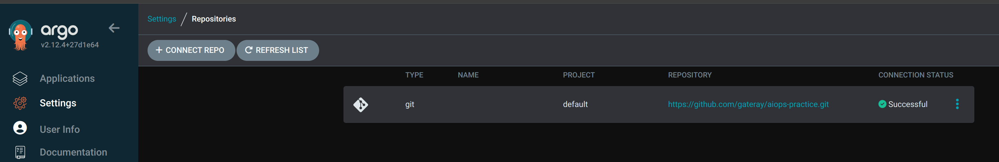
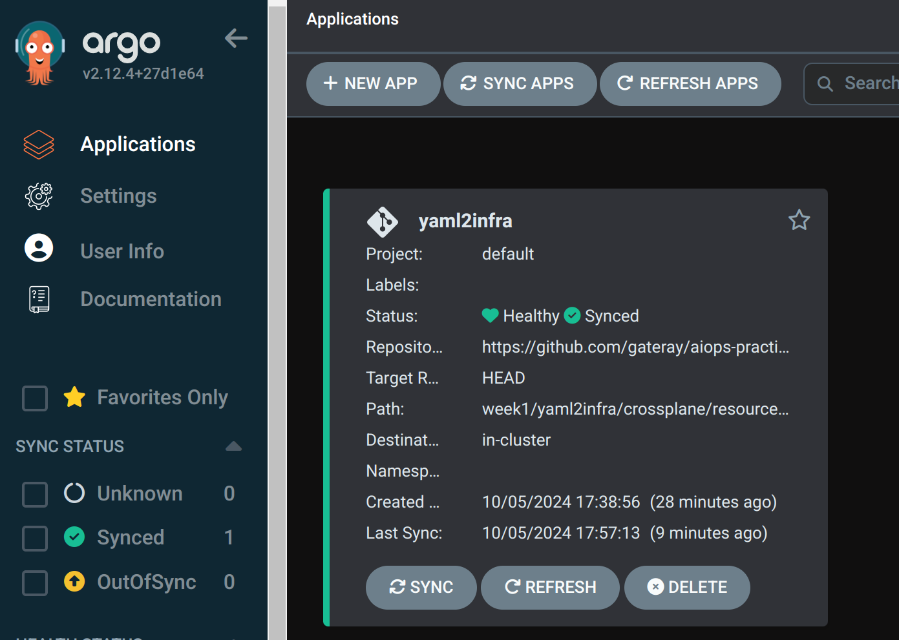
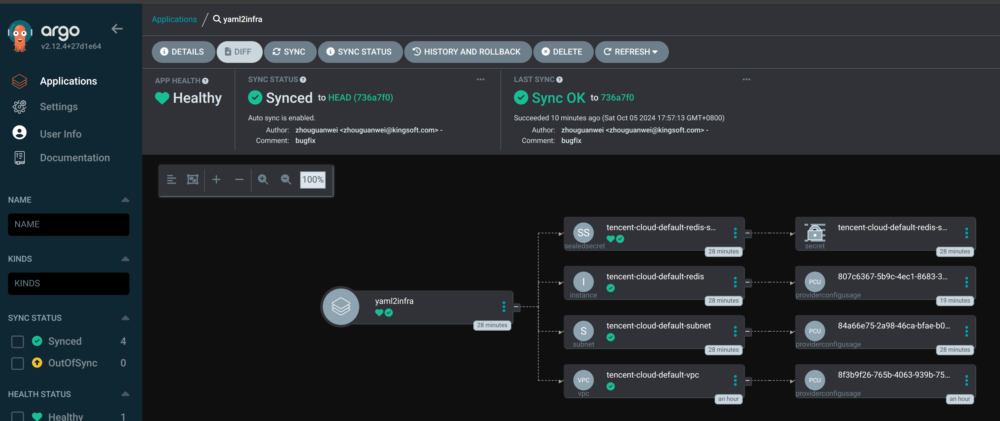
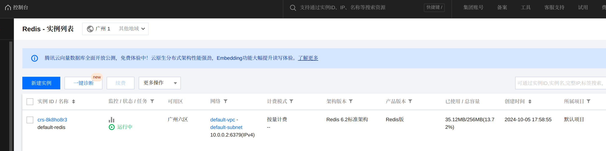

# 使用 YAML to Infra 模式创建云 Redis 数据库
## yaml2infra 目录结构
```
.
├── assets
│   ├── 1-argocd-repository-setting.png
│   ├── 2-argocd-application-setting.png
│   ├── 3-argocd-sync-result.png
│   └── 4-tencent-cloud-redis-created.png
├── crossplane
│   ├── provider
│   │   └── tencent-cloud
│   │       ├── default-provider-config.yaml
│   │       ├── default-provider-cred-sealed-secret.yaml
│   │       └── provider.yaml
│   └── resources
│       └── redis
│           └── tencent-cloud
│               ├── default-redis-sealed-secret.yaml
│               ├── default-redis.yaml
│               ├── default-subnet.yaml
│               └── default-vpc.yaml
├── README.md
└── terraform
    ├── dev
    │   ├── config.yaml
    │   ├── main.tf
    │   ├── variables.tf
    │   └── version.tf
    └── modules
        ├── cvm
        │   ├── main.tf
        │   ├── outputs.tf
        │   ├── variables.tf
        │   └── version.tf
        └── k3s
            ├── main.tf
            ├── outputs.tf
            └── variables.tf

```

## terraform申请cvm、安装k3s、crossplane、argocd
```
export TF_VAR_secret_id=<AK>  # 腾讯云AK
export TF_VAR_secret_key=<SK> # 腾讯云SK
export TF_VAR_cvm_pwd=<ssh login password>   # cvm的ssh登陆密码

cd week1/yaml2infra/terraform/dev

terraform init
terraform plan
terraform apply --auto-approve
```

## 使用sealed-secrets对提交到git的敏感信息进行加密

### cli工具下载安装
```
wget https://github.com/bitnami-labs/sealed-secrets/releases/download/v0.27.1/kubeseal-0.27.1-linux-amd64.tar.gz -O /tmp
sudo tar xf /tmp/kubeseal-0.27.1-linux-amd64.tar.gz -C /usr/local/bin
chmod +x /usr/local/bin/kubeseal
```

### 安装控制器
```
helm repo add sealed-secrets https://bitnami-labs.github.io/sealed-secrets
helm install sealed-secrets -n kube-system --set-string fullnameOverride=sealed-secrets-controller sealed-secrets/sealed-secrets
```

### 生成加密后的sealed-secret文件
```
cat <<EOF | kubeseal --scope cluster-wide -o yaml -w crossplane/provider/tencent-cloud/default-provider-cred-sealed-secret.yaml
apiVersion: v1
kind: Secret
metadata:
  name: tencent-cloud-default-provider-cred-secret
  namespace: crossplane
type: Opaque
stringData:
  credentials: |
    {
      "secret_id": "<your tencent cloud ak>",
      "secret_key": "<your tencent cloud sk>",
      "region": "ap-guangzhou"
    }
EOF
```

## 安装tencent cloud crossplane provider
```
cd week1/yaml2infra
kubectl -n crossplane apply -f crossplane/provider/tencent-cloud/default-provider-cred-sealed-secret.yaml
kubectl apply -f crossplane/provider/tencent-cloud/provider.yaml  # cluster wide
kubectl apply -f crossplane/provider/tencent-cloud/default-provider-config.yaml   # cluster wide
```

## 准备redis 资源清单

### 加密redis的secret文件
```
kubectl -n crossplane create secret generic tencent-cloud-default-redis-secret --from-literal=pwd=<your redis password> --dry-run=client -oyaml | kubeseal --scope cluster-wide -o yaml -w crossplane/resources/redis/tencent-cloud/default-redis-secret.yaml
```

## 配置argocd自动拉取资源清单
argocd默认帐号为：admin
默认密码获取方式：
```
kubectl -n argocd get secret argocd-initial-admin-secret -o jsonpath='{.data.password}' | base64 -d
```
开启argocd webui端口转发
```
kubectl port-forward svc/argocd-server -n argocd 8080:80
```

## 最终效果图
argocd配置github仓库连接:


argocd应用配置：


argocd同步yaml结果：


tencent cloud redis实例创建结果：

